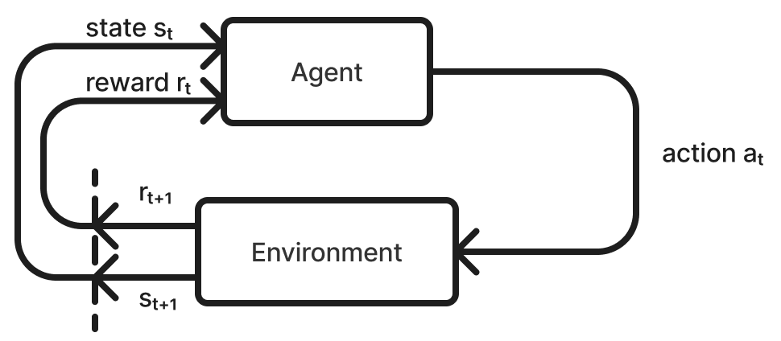
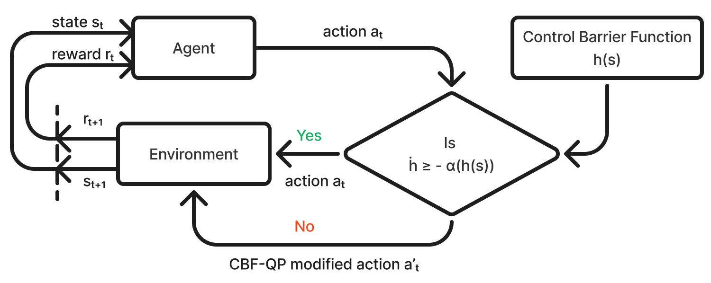
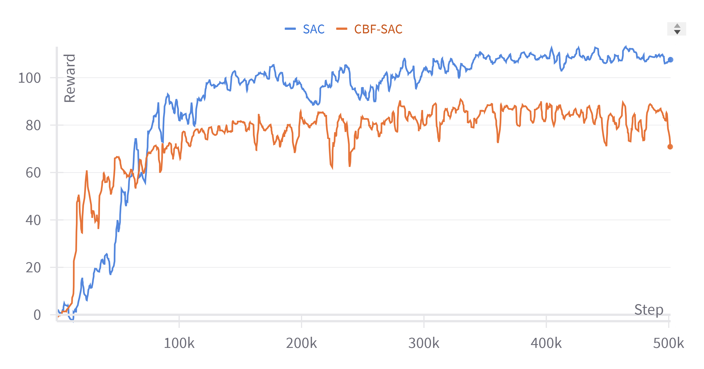
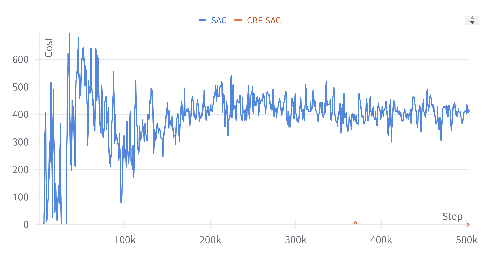
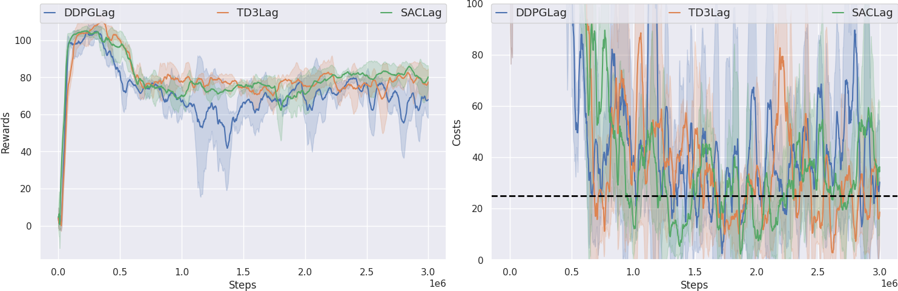
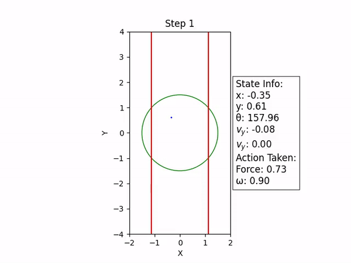
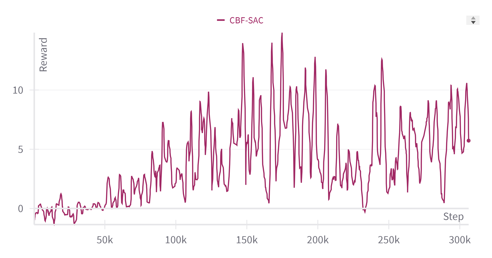
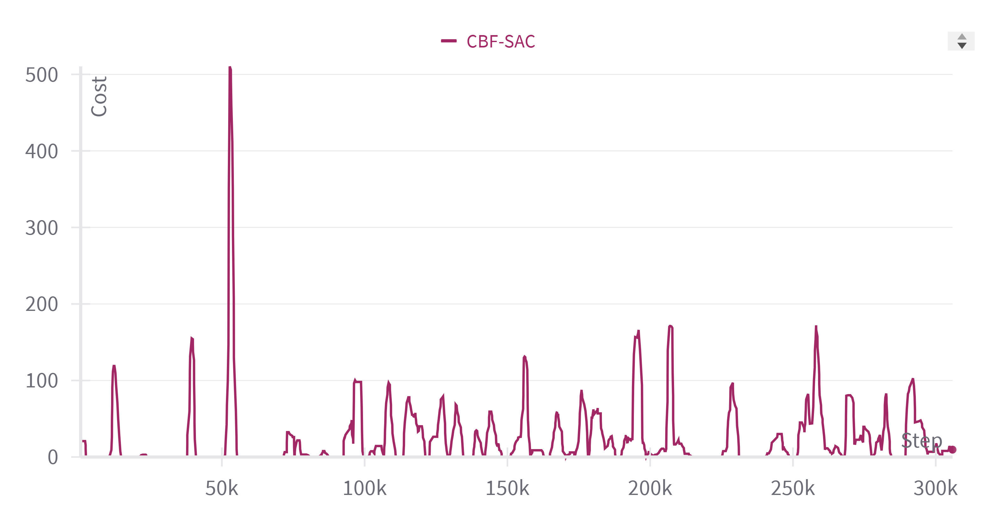

# Safe Reinforcement Learning

## Introduction
Reinforcement Learning has been demonstrated to learn optimal behaviour for many tasks, resulting in enhanced performance in many systems. But when it comes to training an RL agent, it is often done offline, with no constraint on number of failures before learning optimal behaviour. Since real life systems may not be accurately simulated, offline training an agent and then deploying it in real world may not match the performance that is desired. When it comes to online learning, safety considerations come into play, and hence, seemingly large number of safety violations cannot be made to learn the desired behaviour.

## Problem Statement
The challenge to safe RL is to avoid unsafe states while exploring. This can be performed by allowing the agent to explore freely, but when it experiences a unsafe state, the policy is optimized to minimize the visits to that state. This can be understood as learning by making errors, but with minimal errors. Other approach is to predict the unsafe regions using human input and system dynamics. For safety critical systems, the second approach is preferred, and it can help with close to zero safety violations throughout training process. Although there are many literature work related to minimizing safety violations even during training, most works do not achieve near zero training time safety violations. 

This study aims to construct barrier functions from human inputs about the safety and dynamics of the agent, to attain near zero safety violations. To propose the methodology, a brief description of the reinforcement learning and control barrier functions are provided. 

## Reinforcement Learning Funamentals

Reinforcement learning \cite{Andrew_1999} is one of the three pillars of machine learning, along with supervised and unsupervised learning. Supervised learning involves learning a mapping from inputs to outputs using a labelled dataset, unsupervised learning involves learning of underlying patterns or structure in the data without any labelled outputs. Reinforcement learning is different in the sense that it interacts with environment, receives feedback in the form of a reward signal, and learns to sequentially make decisions to get better reward signals. **Figure 1** depicts the interaction between agent and the environment in a classical RL setup.

*Figure 1: RL Flow Chart*

### Markov Decision Process (MDP)

In reinforcement learning, an agent interacts with an environment modeled as a Markov Decision Process (MDP). An MDP is defined as a tuple $(\mathcal{S}, \mathcal{A}, p, r)$, where:

- **$\mathcal{S}$** represents the **state space**, which is the set of all possible states in the environment. A state $s_t \in \mathcal{S}$ captures all relevant information about the environment at time step $t$.
- **$\mathcal{A}$** represents the **action space**, which is the set of all possible actions that the agent can take. An action $a_t \in \mathcal{A}$ is chosen by the agent at each time step $t$.
- **$p$: $\mathcal{S} \times \mathcal{S} \times \mathcal{A} \rightarrow \mathbb{R}^+$** represents the **transition probability distribution**, where $p(s_{t+1} \mid s_t, a_t)$ denotes the probability density of transitioning to state $s_{t+1}$, given the current state $s_t$ and action $a_t$. This function encapsulates the dynamics of the environment.
- **$r$: $\mathcal{S} \times \mathcal{A} \rightarrow \mathbb{R}$** represents the **reward function**, where $r(s_t, a_t)$ gives the scalar reward received by the agent when it takes action $a_t$ in state $s_t$. The reward function quantifies the immediate benefit of taking a particular action in a given state.

### Reinforcement Learning Objective

The goal in reinforcement learning is to learn a policy $\pi(a_t \mid s_t)$, which defines a strategy for selecting actions given a state. Specifically, the policy $\pi(a_t \mid s_t)$ provides the probability of choosing action $a_t$ when in state $s_t$. 

In an infinite-horizon Markov Decision Process (MDP), the objective is to learn an optimal policy $\pi^*$ that maximizes the expected cumulative reward over an infinite time horizon. The expected return from a state $s_t$ following a policy $\pi$ is given by:

$$
J(\pi) = \mathbb{E}_{\pi} \left[ \sum_{k=0}^{\infty} \gamma^k r(s_{t+k}, a_{t+k}) \mid s_t = s \right]
$$
where:
- **$\gamma \in [0, 1)$** is the discount factor, which balances the trade-off between immediate and future rewards. A lower value of $\gamma$ emphasizes immediate rewards, while a value closer to 1 gives more weight to future rewards.
- The expectation **$\mathbb{E}_{\pi}$** is taken over the trajectory distribution induced by the policy $\pi$.

The goal is to find an optimal policy $\pi^*$ that maximizes this objective:

$$
\pi^* = \arg\max_{\pi} J(\pi)
$$
This optimal policy ensures that the agent achieves the highest possible cumulative reward over time.

## Methodology
Given the access to the dynamics of the agent, we propose the following steps to learn an optimal policy that is safe:

- **Construct a Control Barrier Function (CBF)** to express the safety of the system.
- **Take an action** according to the current policy.
- **Check if the CBF constraint is violated** by the policy action. If it violates, solve the CBF-QP to obtain the closest safe action, else the policy action is the safe action.
- **Execute the safe action.**

The same process is depicted in **Figure 2**.

*Figure 2: RL Flow Chart with CBF*

## Results

A Soft Actor Critic (SAC) algorithm-based reinforcement learning agent was trained for 0.5 million steps on both environments. Control Barrier Functions (CBFs) were designed based on the specifics of the environment and were used to rectify the actions made by the agent if they were deemed unsafe.

While DDPG-based training was also performed, the performance was not satisfactory. The rewards did not stabilize and instead kept oscillating with high variance. Therefore, only the results for the SAC-based agent are provided.

As evident in **Figure 3** and **Figure 4**, the rewards steadily increase with training steps, and the safety is ensured at almost all steps. It is to be noted that existing benchmarks with SAC Lagrangian achieve similar rewards, but with significantly higher associated costs. These are evident from **Figure 4** and **Figure 5**, especially in the latter where even after one million time steps, cost oscillates and does not reach zero. However, the CBF based RL achieves zero cost for most of the training time, except for few episodes. Note that the Fig. **Figure 3** and **Figure 4** was smoothed using running average over 10 past steps to facilitate a smooth curve. The fact that our method incurs cost for around just one episode, and that too minimal in magnitude demonstrates the robustness of the framework. Even this could be avoided with appropriate conservative parameter tuning in the CBF formulation. A video demonstration of the Circle environment navigation task is provided in **Figure 6**.

*Figure 3: Training time Reward Curves for SAC and CBF based SAC*

*Figure 4: Training time Cost Curves for SAC and CBF based SAC*

*Figure 5: Training time Cost Curves for SAC Lagrangian*

*Figure 6: 2D video demonstration of agent navigating the Circle environment*

Unlike the Circle environment, as evident from in **Figure 7**, the rewards does not steadily increase with training steps, and rather oscillate violently. However, existing benchmarks with SAC Lagrangian achieve significantly higher rewards, with costs of the range 30 at the end of training. These are illustrated in **Figure 9**  and **Figure 10** . A video demonstration of the Circle environment navigation task is provided in **Figure 11** as well as in the GitHub repository. From the video, it is observed that the agent gets stuck in between and remains still sometimes. This could be due to the fact that the CBF may not be defined properly.

*Figure 7: Training time Reward Curves for SAC and CBF based SAC*

*Figure 8: Training time Cost Curves for vanilla SAC*

*Figure 9: Training time Cost Curves for SAC and CBF based SAC*

*Figure 10: Training time Cost Curves for SAC and CBF based SAC*

*Figure 11: 2D video demonstration of agent navigating the Circle environment*

## Training Performance Comparison Between Algorithms

| Environment | Algorithm | Reward | Cost | Steps Trained | Time (in hours) |
|-------------|-----------|--------|------|---------------|-----------------|
| Circle      | SAC       | ~100   | ~400 | 500,000       | 5               |
| Circle      | SAC CBF   | ~80    | ~0   | 500,000       | 8               |
| Goal        | SAC       | ~28    | ~25  | 300,000       | --              |
| Goal        | SAC CBF   | ~7     | ~60  | 300,000       | 10              |

## Conclusion and Future Work

In this work, we have developed a framework to specify safety through control barrier functions (CBFs) and aid a reinforcement learning (RL) agent in learning without safety violations during training. A Soft Actor-Critic (SAC) algorithm was utilized to train the RL agent. However, the results are promising only for the Circle environment in the Safety Gymnasium, and more work on other environments is required.

It is important to note that constructing a CBF is not trivial and requires extensive knowledge of the problem at hand and a deep understanding of safety. While such knowledge is necessary for safety-critical systems, in general, one would prefer to learn the notion of safety from expert demonstrations. Future work can focus on learning an underlying CBF from expert demonstrations performed at the boundary of the safe region. Since the CBF requires a forward invariance property, it is desirable to parameterize it using continuous and differentiable networks. Additionally, the safe action must be solved using a CBF-QP solver, so the idea of Neural ODEs could be explored.

Moreover, during the training process, the number of times the policy action is rectified by the CBF-QP is not penalized. As a result, the agent might not quickly learn a safe policy and may perform with safety violations when the CBF rectifier is removed. A regularization term to penalize calls to the CBF rectifier could potentially make the policy safe even when the CBF is removed. However, extensive hyperparameter tuning might be required to identify the appropriate scale for the regularization term.
